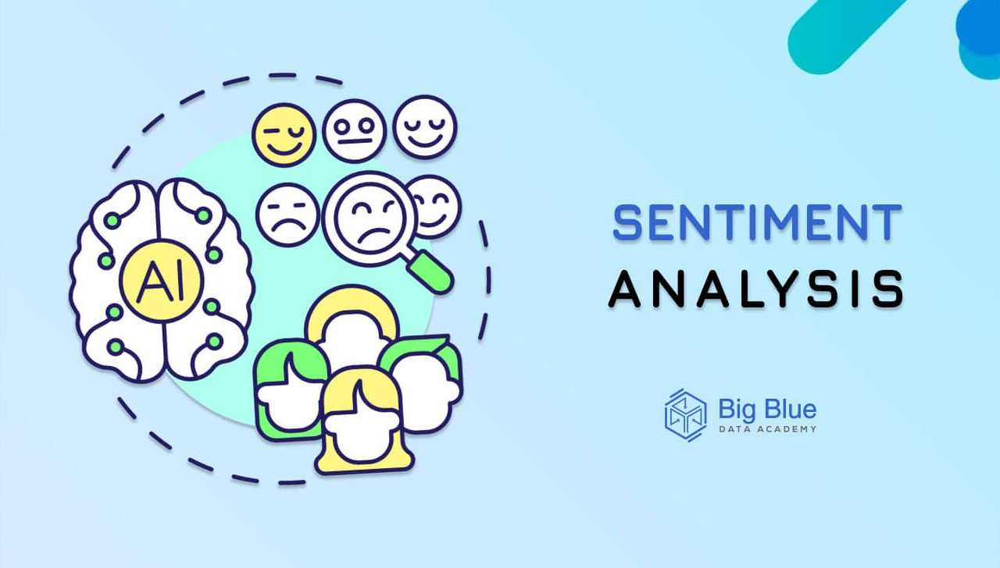
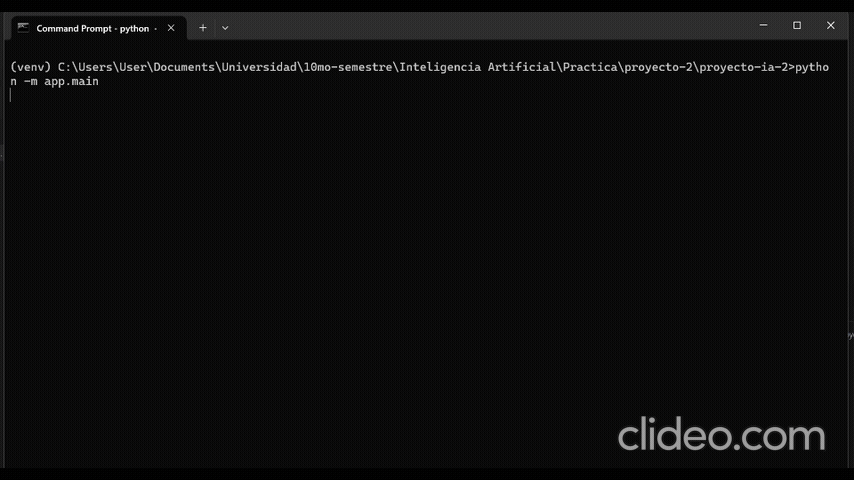

<div align="center">
  
</div>

# Second Project AI

# 🚀 Final Project: Image Text Recognition & Sentiment Analysis System

<div align="center">
  
</div>

This repository contains the details of the Image Text Recognition and Sentiment Analysis

## Contents

### 🎯 Project Objective**  
Build a two-stage AI pipeline that can:

1. **Read Text from an Image 📷**  
   - Leverage a model trained on the **IIIT-5K Words** dataset to detect and transcribe any text in an image (e.g., a sign, screenshot, or advertisement).

2. **Analyze Sentiment ❤️ 😭 😐**  
   - Feed the extracted text into a **Recurrent Neural Network (RNN)** trained on the **Twitter Sentiment Dataset** to classify it as **positive 👍**, **negative 👎**, or **neutral 😐**.

The goal is to create an end-to-end system that can  
- **“see” an image 👁️**  
- **“read” its contents 📝**  
- **“understand” the tone of the message 🧠**

### 📊 Dataset: IIIT5K-Words

**🔗 Source & Download**  
- Curated by IIIT-Hyderabad (IIIT-H).  
- Distributed as a `.tar.gz` archive with annotations in MATLAB `.mat` files.  
- Official download: IIIT5K-Words [official site]().

**🗂️ Size & Structure**  
- **Total images**: 5,000 single‐word crops  
- **Suggested split**:  
  - Train: 3,000 images  
  - Test:  2,000 images  
- **Image format**: JPG/PNG, each containing one isolated word  
- **Annotations**:  
  - `testdata.mat` → list of image paths + word labels  
  - `testCharBound.mat` → per‐character bounding‐box coordinates

**🔣 Content & Complexity**  
- **Typographic variability**:  
  - Multiple **fonts**, **sizes** and **styles** (italic, bold, serif, sans-serif)  
- **Real-world challenges**:  
  - Noisy or semi-transparent backgrounds  
  - Partially occluded characters  
  - Compression artifacts and blur

**🏷️ Labeling**  
- Each image shows **exactly one English word**.  
- Ground‐truth

### ❓ The Missing Data Challenge

Although the standard Wine Quality Dataset does not include missing values, in real-world scenarios it is very likely that some physicochemical measurements may be absent when evaluating a wine. Therefore, a fundamental aspect of this application is its capacity to manage the absence of one or more input values provided by the user. 🤷‍♂️

## Requirements

- Python
- Dataset OCR: The dataset was provided in the following link [OCR Images](https://www.kaggle.com/datasets/prathmeshzade/iiit5k-words/data)
- Dasatet Sentiments: The dataset was provided in the following link [Sentiment dataset](https://github.com/garnachod/TwitterSentimentDataset)

## Installation

1. Clone the project on your computer:

   ```bash
   git clone https://github.com/C102002/proyecto-ia-2
   ```

>[!NOTE]  
> Python Version 3.11 🚀:
> - **Dependency Compatibility:** Using **Python 3.11** helps resolve known issues with data analysis and dependency conflicts with libraries like **Keras** and **TensorFlow**. ⚙️  
> - **Bug Fixes & Stability:** This version includes essential fixes and improvements that enhance overall stability, ensuring smoother execution of your ML workflows. 🐛✅  
> - **Optimized Performance:** With core runtime improvements, Python 3.11 delivers faster execution and better resource management during data processing and model training. ⚡💻  
>  
> Adopting Python 3.11 is crucial for building robust, efficient applications in data science and deep learning.


2. Create the Python virtual environment

   ```bash
   # Run the following command to create a virtual environment in the project directory:
   py -3.11 -m venv venv  
   ```

3. Activate the virtual environment

   ```bash
   # Windows (using Command Prompt):
   venv\Scripts\activate

   # Windows (using PowerShell):
   .\venv\Scripts\activate.ps1

   # macOS and Linux:
   source venv/bin/activate
   ```

4. Install the dependencies

   ```bash
   # Run the following command:
   pip install -r requirements.txt
   ```

5. Update dependencies

   ```bash
   # Run the following command to update the requirements file:
   pip freeze > requirements.txt
   ```

   NT
   ```bash
   # Run this if the requirements file appears with strage values
   pip freeze | Out-File requirements.txt -Encoding utf8
   ```


## 6. Models ⚙️

### 🖼️ Optical Character Recognition (OCR) 📸🔠  
**STR model [1]** trained and evaluated on the **IIIT-5K Words dataset [2]**.  
Detects and transcribes words in images with varied fonts, sizes, and noise levels, producing a clean, ordered text string.

### 💬 Sentiment Analysis ❤️🖤  
**Bidirectional LSTM RNN [3][4]** trained on the **Twitter Sentiment Dataset [5]**.  
Classifies each extracted fragment as positive 😊, negative 😞, or neutral 😐, revealing the underlying intent and tone.

---

## 7. Application 🚀

The final app ties both models into a simple pipeline: upload an image, extract its text, then analyze its sentiment.

### Usage


1. Example of usage

```bash
# In the root of the project
python -m app.main 
```

Then wait a litle bit to show the main menu

```bash
? Bienvenido, ¿qué desea hacer? (Use arrow keys)
 » 1. Cargar imagen
   2. Probar con un ejemplo
   3. Instrucciones
   4. ¿Quiénes somos?
   5. Informacion de los modelos
   6. Salir
```


Video of example of correct usage

[](./public/videos/example/example-of-usage.mp4)

## 8. Architecture

[](./public/images/photos/Diseño%20General%20de%20Sistema%20de%20Reconocimiento%20de%20Texto%20en%20Imágenes-2025-07-10-0128.svg)


## Contributions

<table align="center">
    <tbody>
        <tr>
            <td align="center">
                <a href="https://github.com/Fussita" rel="nofollow">
                    
                    <br>
                    <sub><b>Hualong Chiang</b></sub>
                </a>
                <br>
                <a href="" title="Commits">
                    <g-emoji class="g-emoji" alias="book" fallback-src="https://github.githubassets.com/images/icons/emoji/unicode/1f4d6.png">📖</g-emoji>
                </a>
            </td>
            <td align="center">
                <a href="https://github.com/C102002" rel="nofollow">
                    
                    <br>
                    <sub><b>Alfredo Fung</b></sub>
                </a>
                <br>
                <a href="" title="Commits">
                    <g-emoji class="g-emoji" alias="book" fallback-src="https://github.githubassets.com/images/icons/emoji/unicode/1f4d6.png">📖</g-emoji>
                </a>
            </td>
            <td align="center">
                <a href="https://github.com/DanielBortot" rel="nofollow">
                    
                    <br>
                    <sub><b>Daniel Bortot</b></sub>
                </a>
                <br>
                <a href="" title="Commits">
                    <g-emoji class="g-emoji" alias="book" fallback-src="https://github.githubassets.com/images/icons/emoji/unicode/1f4d6.png">📖</g-emoji>
                </a>
            </td>
            <!-- add other members -->
            <td align="center">
                <a href="https://github.com/juanpj17" rel="nofollow">
                    
                    <br>
                    <sub><b> Juan Perdomo</b></sub>
                </a>
                <br>
                <a href="" title="Commits">
                    <g-emoji class="g-emoji" alias="book" fallback-src="https://github.githubassets.com/images/icons/emoji/unicode/1f4d6.png">📖</g-emoji>
                </a>
            </td>
            <td align="center">
                <a href="https://github.com/Gamartinez25" rel="nofollow">
                    
                    <br>
                    <sub><b> Gabriela Martinez</b></sub>
                </a>
                <br>
                <a href="" title="Commits">
                    <g-emoji class="g-emoji" alias="book" fallback-src="https://github.githubassets.com/images/icons/emoji/unicode/1f4d6.png">📖</g-emoji>
                </a>
            </td>
        </tr>
    </tbody>
</table>

## License

This project is under Apache license. See the [LICENSE](LICENSE) file for more details.